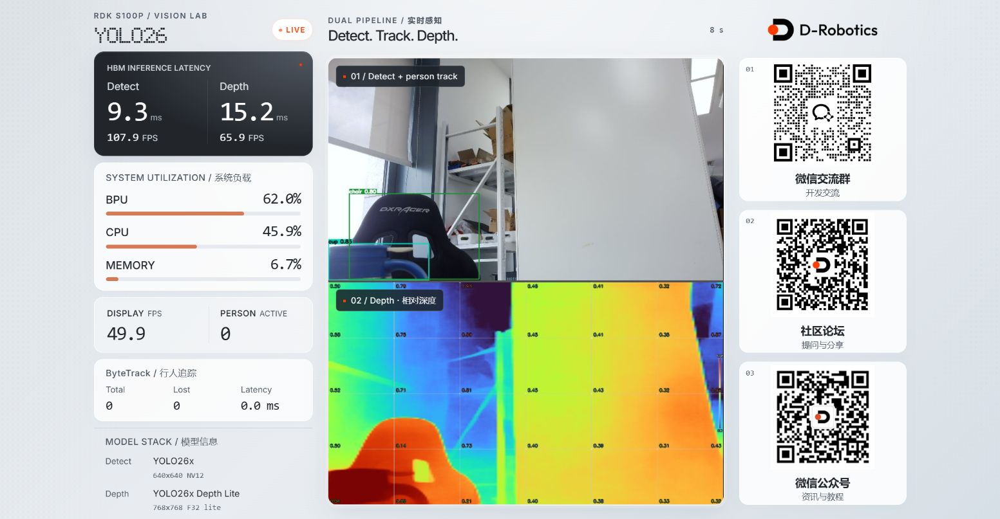

<div align="center">

# YOLO26 Vision Lab

**检测 · 跟踪 · 深度，一块 RDK S100P。**

原生 C++ 双模型视觉流水线，配合实时浏览器展示界面。

[English](README.md) · [简体中文](README_cn.md) · [系统架构](docs/architecture.md) · [Web UI](docs/web-ui.md)


</div>

## 先看效果

YOLO26 目标检测与单目深度估计共享 BPU 调度器，原生 C++ ByteTrack 在 CPU
上关联行人检测结果。浏览器集中呈现双画面与实时性能数据，无需前端构建工具。



*2026-09-09 实机截图，EMEET PIXY，1920×1080@30 输入。截图为瞬时状态，不是性能基准报告。*

| 目标检测 | 行人跟踪 | 深度估计 |
| :--- | :--- | :--- |
| YOLO26x · 640 × 640 NV12 | ByteTrack · 行人 ID | YOLO26x Depth Lite · 768 × 768 |
| 检测框与类别标签 | 原生 C++ 关联及轨迹生命周期 | Turbo 伪彩与相对深度网格 |

> **默认显示相对深度，不是已标定测距仪。**
> `--depth-meters K` 提供比例换算，不能单凭该参数保证米制测距精度。
> ByteTrack 是跟踪算法，并非第三个神经网络模型。

## 展示界面

新版采用银灰背景、点阵标题、石墨色延迟面板和低饱和橙色占用条。

- **左侧：** Detect / Depth 独立 HBM 延迟及换算 FPS，BPU / CPU / 内存占用，
  显示帧率、活跃行人数、ByteTrack 指标卡片，以及模型名称和输入规格。
- **中间：** 上方检测与行人跟踪，下方深度网格；完整显示画面，移除编码黑边及重复调试文字。
- **右侧：** 品牌标识与三个社区二维码。
- **适配：** 面向桌面 16:9 展示，窄屏自动调整布局，支持减少动态效果的系统偏好。

Inter 与 Bubbledot 字体由**观看页面的浏览器**从外网加载；离线时回退到系统字体。
修改 [`web/index.html`](web/index.html) 后刷新即可生效，服务端每次请求重新读取页面。

## 快速开始

### 1 · 准备板端环境与模型

需要 RDK S100P、Hobot DNN/UCP 运行库、OpenCV 4.x、libdrm、CMake 和 C++17 编译器。
使用 V4L2 摄像头；EMEET PIXY 的设备编号可能随 USB 枚举变化，请先确认
`/dev/videoN`，不要把元数据节点当作视频输入。

以下命令在**板端执行**：

```bash
git clone https://github.com/maxma615/yolo26-detect-depth-demo.git
cd yolo26-detect-depth-demo
# 替换为已有兼容 Nash-m HBM 模型所在目录。
MODEL_SRC=/path/to/existing/models bash scripts/download_models.sh
```

默认加载的两个模型**不包含在 Git 仓库中**：

```text
models/yolo26x_detect_nashm_640x640_nv12.hbm
models/yolo26x_depth_lite_nashm_768x768.hbm
```

需自行准备兼容模型。也可将 `MODEL_URL` 指向自己的模型托管地址，
本仓库不承诺提供可直接下载的公开模型链接。

### 2 · 编译并运行

默认采集配置为 **1920×1080@30**；以下命令显式指定参数，便于复现：

```bash
cmake -S cpp -B cpp/build -DCMAKE_BUILD_TYPE=Release
cmake --build cpp/build -j4

# 将 --source 改为实际视频设备编号；本次截图使用 /dev/video0。
bash scripts/run.sh --source 0 --cam-w 1920 --cam-h 1080 --cam-fps 30 \
  --grid-cols 6 --grid-rows 4
```

浏览器打开 **http://板端IP:8080/**。前台运行时按 **Ctrl+C** 退出。

<details>
<summary>从 Linux / WSL 主机部署</summary>

```bash
BOARD=root@BOARD_IP bash scripts/deploy.sh
```

该脚本覆盖目标项目文件并在板端重新构建，**不会上传本机的 models/ 目录**。
需另行把模型放入目标目录下的 `models/`。默认部署目录为
`/userdata/yolo26_dual_demo`。

已有环境请先检查脚本：它会重建 build 目录，且当前实现关闭了 SSH 主机密钥校验。

</details>

## 性能与统计口径

以下是 S100P 上默认模型组合、BPU 1.5 GHz 条件下的**参考观测，不是性能保证**。
早期项目记录报告 1080p@30 输入下约 29.5 FPS；9 月 8 日 UI 验证采用
720p@30。这些不是同一轮受控分辨率对比，不能据此宣称提高采集分辨率没有额外开销。

| 指标 | 参考量级 | 含义 |
| :--- | :--- | :--- |
| Detect HBM 延迟 | 约 9.2 ms | BPU 任务平均延迟 |
| Depth HBM 延迟 | 约 15.8 ms | BPU 任务平均延迟 |
| 检测 / 深度处理帧率 | 30 FPS 输入下约 29–30 FPS | 各推理线程处理速率 |
| 显示更新帧率 | 约 50 FPS | 可复用推理结果，不等于每秒推理 50 个独立输入帧 |

HBM 面板中的 **FPS = 1000 ÷ 平均 HBM 延迟（ms）**，
不包含前后处理及共享资源竞争，不能当作端到端吞吐量。
显示 FPS、采集 FPS 和模型处理 FPS 也不是同一指标。

流水线采用**最新帧优先**策略，负载较高时可能跳过旧帧。
接近的帧率不能证明零丢帧；如需验证，应限定测试时长并逐帧核对输入及处理序号。
仓库目前未附可复现的长时间零丢帧测试报告。

## 相机跟踪与 HDMI

```bash
# 可选：EMEET PIXY 固件级自动跟踪，会驱动相机转动。
python3 -m pip install hidapi
sudo python3 scripts/pixy_tracking.py on
sudo python3 scripts/pixy_tracking.py off

# 可选：DRM/KMS 直出，设备编号按实际情况修改。
bash scripts/run.sh --source 0 --hdmi
```

相机固件跟踪与 ByteTrack 相互独立。HDMI 输出的是原生合成画面，
**不是浏览器银白 UI 的镜像渲染**。开机自启脚本可能关闭桌面以获取 DRM 控制权，
使用前请阅读文档。

## 深入了解

| 文档 | 内容 |
| :--- | :--- |
| [系统架构](docs/architecture.md) | 工作线程、帧交换和输出 |
| [Web UI](docs/web-ui.md) | 统计接口、页面定制及连接状态 |
| [EMEET PIXY](docs/camera-pixy.md) | 相机选择与固件跟踪 |
| [HDMI](docs/hdmi.md) | DRM/KMS 输出及桌面交互 |
| [打包](docs/packaging.md) | 构建 Debian 安装包 |

```text
cpp/       原生推理、ByteTrack、合成、HTTP、KMS 及测试
web/       浏览器界面与品牌 / 二维码素材
scripts/   启动、部署、模型准备及相机控制
docs/      使用指南与截图
assets/    类别标签及示例素材
```

编译后运行原生测试：

```bash
ctest --test-dir cpp/build --output-on-failure
```

## 许可证

仓库代码采用 [MIT](LICENSE) 许可证。模型权重、数据集、字体及其他第三方素材
遵循各自许可证。
